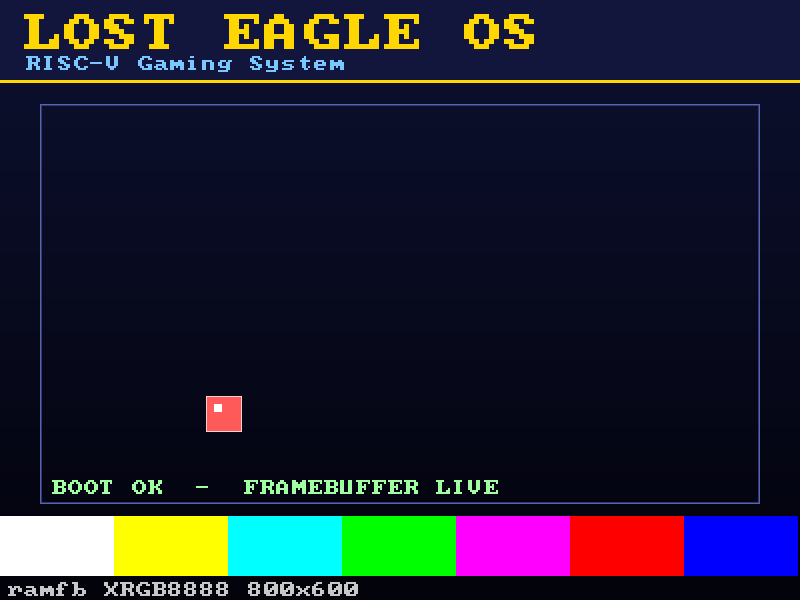

# Lost Eagle OS

A from-scratch operating system for **RISC-V (rv64)**, aimed at becoming a small
gaming system. It boots on the QEMU `virt` machine under OpenSBI, logs over the
serial port, and draws graphics to a framebuffer using QEMU's `ramfb` display
device.

This is **milestone 1: boot + framebuffer graphics**. The kernel renders a boot
screen (title, play-area frame, status text, SMPTE colour bars) and animates a
bouncing sprite, proving the full display path works end to end.



## What it does

- Runs as an **S-mode** kernel, loaded by OpenSBI at `0x80200000`.
- **Serial logging** via the NS16550A UART at `0x10000000`.
- **Graphics** via QEMU `ramfb`, configured over the `fw_cfg` DMA interface
  (800x600, XRGB8888).
- Software rendering primitives: pixels, filled/outlined rectangles, vertical
  gradients, and an 8x8 bitmap **text font**.

## Layout

```
src/
  boot.S       # entry point: stack setup, .bss clear, jump to kmain
  kernel.c     # kmain: serial banner, ramfb init, render loop
  uart.c/.h    # 16550 UART driver (serial logging)
  fw_cfg.c/.h  # QEMU fw_cfg DMA driver (read files, write items)
  ramfb.c/.h   # configures the ramfb display device
  gfx.c/.h     # framebuffer drawing primitives + text
  font8x8.h    # public-domain 8x8 bitmap font
linker.ld      # links the image at 0x80200000
Makefile       # build + run targets
tools/
  screenshot.py  # boot headless and capture a framebuffer PNG (dev/CI helper)
```

## Prerequisites

- A bare-metal RISC-V toolchain providing `riscv-none-elf-gcc`
  (e.g. the [xPack GNU RISC-V Embedded GCC](https://github.com/xpack-dev-tools/riscv-none-elf-gcc-xpack)).
- `qemu-system-riscv64` (QEMU 7.0+; tested on QEMU 11).
- `make`.

If your toolchain uses a different prefix, override it:

```sh
make CROSS_COMPILE=riscv64-unknown-elf-
```

## Build

```sh
make
```

This produces `build/kernel.elf`.

## Run

Graphical window (shows the framebuffer):

```sh
make run
```

Headless / serial only (handy for CI):

```sh
make run-headless
```

Both pass `-device ramfb`, which is required for the display to appear.
The raw QEMU invocation is:

```sh
qemu-system-riscv64 -machine virt -m 256M -bios default \
    -kernel build/kernel.elf -device ramfb -serial mon:stdio
```

To exit the QEMU window, close it; from the serial console use `Ctrl-A X`.

## Capture a screenshot

`tools/screenshot.py` boots the kernel headless, grabs a framebuffer dump via
the QEMU monitor, and writes a PNG (requires Python + Pillow):

```sh
python tools/screenshot.py boot-screen.png
```

## Roadmap

- Timer interrupts (replace the busy-wait delay) and a periodic tick.
- Keyboard / gamepad input (virtio-input) for interactive control.
- Double buffering and a simple sprite/tile engine.
- A tiny game on top of the rendering layer.
